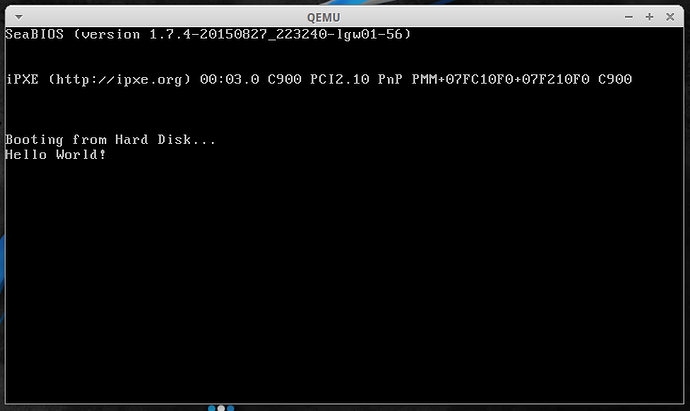

# Realmode Assembly - Writing bootable stuff - Part 2
## Part 2: Hello World Bootloader

----------

## What is this?
This is going to be a walk-through in writing an Operation System in assembly which operates purely in Realmode.
Goal will be writing different kernels from a simple "Hello World" over small terminal programs to
graphically displayed games.
	
	
## Requirements:
* Being able to read x86 Intel Assembly
* Being tolerant enough to accept my assembly code even though it might not be perfect
* Reading the previous article
	
## Notes

* This information is the result of my research and own programming, everything said here might be wrong, correct me if you spot mistakes though!
* I will try to list my sources at the bottom but I can't guarantee that these are all of them.
* I'M NOT RESPONSIBLE IF YOU BREAK SOMETHING USING INFORMATION I PROVIDED HERE.
	
## Content of this Article:
This article will be about writing a Master Boot Record that loads a small
kernel into memory that then prints out a "Hello World" message
	
## Tools used:

* NASM for compiling assembly code to raw binary
* A text editor to write the code in


----------


## Writing a loader for the kernel:

So to start we are going to write a minimalistic bootloader that just loads the kernel and then gives control to it. We will improve the bootloader later and make it more abstract and reliable but for the explanation this will be enough.
	
Let's go:
We will need to execute two interrupts, one to reset the disk system which will ensure we will read the right partand one to read the kernel from hard drive to RAM. As already explained in the last article we will use the interrupt 0x13 which decides which disk operation to execute based on the ah register (higher byte of ax, which is the lower word of eax).

For the disk resetting we will use the first function of the interrupt 0x13, so ah will be set to 0. I will use the syntax int 0x13,0 to refer to this interrupt to make my life a bit easier. Int 0x13,0 takes two parameters ah = 0 and dl = drive number (a number representing a specific drive. for example: 0x80 = drive 0). Luckily the BIOS (or better said almost every BIOS) puts the drive number of the device currently booting from (in our case the hard drive the kernel is on or an emulated device) into dl before giving control to the MBR, so we will assume that the drive number is already in dl which will be the case most of the time.

```plain
|----int----|--ah--|------dl------|------Description------|
|  int 0x13 |   0  | drive number | Resetting Disk System |
|-----------|------|--------------|-----------------------|
```

As already explained previously the bootloader will be loaded into 0st segment at address 0x7c00 so we also have to tell NASM to calculate offsets starting from that address. Also let's tell NASM that we are in 16bit mode so it tells us when we use illegal instructions for this mode and knows how to correctly refer to memory.
 
```asm
org 0x7C00 ;NASM now calculated everything with the right offset
bits 16
mov ah, 0
int 0x13 ;  int 0x13,0  dl = drive number
..
```


Now that the disk system is reset we can start reading from the correct offset of the hard drive we boot from. For that we will use int 0x13,2. It takes an address within the RAM to write in as argument into bx, we will just write it to 0x8000 as it's free space. The al register will contain the amount of sectors to read, this will be the size of our kernel and as our HelloWorld Kernel will be small we just write a 1 into al (1 sector = 512 bytes, size of kernel has to be multiple of 512 bytes). If we increase the size of our kernel we have to increase this number as well and because it's pretty annoying to change this every time we make the kernel bigger so we will later look at ways to make this easier for us. The address to read from is in the Cylinder-Head-Sector (CHS) format (which is a pretty old format for addresses on hard drives) so we have to do some converting (also knowing the math behind those numbers helps reading from other segments):


(Following values are true for 1.44 MB 3.5" Floppy Disks , the theory applies for every hard drive. Obviously this memory layout doesn't make sense for USB-Devices and similar but as it's the way the BIOS works we will later add a Standard BIOS Parameter Block which will define the following values for the BIOS)

Each Sector has a size of 512 (BytesPerSector) bytes. Sectors start with 1.
Each Head contains 18 (SectorsPerTrack) sectors.
Each Cylinder (also called Track) contains 2(Sides) Heads. There are 2(Sides) Cylinders. 

Using this we can calculate the CHS-Values for the logical segment(continuous numeration starting from 0) we want to read from. The bootloader is at logical segment 0 (as it's the first segment on the hard drive). After that the kernel follows at logical segment 1 (as it's directly after the bootloader on the hard drive and the bootloader is exactly 512 bytes (1 segment) in size.)

```plain
|----int----|--ah--|------dl------|-------ch------|------dh------|------cl--------|------Description------|
|  int 0x13 |   2  | drive number | Reading Track | Reading Head | Reading Sector | Read from Hard drive  |
|-----------|------|--------------|---------------|--------------|----------------|-----------------------|
```

```plain
Logical segment ls = 1
=>
Cylinder is saved in ch
ch = Cylinder/Track = (ls/SectorsPerTrack)/Sides = 0
Head is saved in dh
dh = Head =(ls/SectorsPerTrack)%Sides = 0
Sector is saved in cl
cl = Sector = (ls%SectorsPerTrack)+1 = 2
```

Our new code now looks like this:
```asm
..
mov bx, 0x8000     ; bx = address to write the kernel to
mov al, 1 		   ; al = amount of sectors to read
mov ch, 0          ; cylinder/track = 0
mov dh, 0          ; head           = 0
mov cl, 2          ; sector         = 2
mov ah, 2          ; ah = 2: read from drive
int 0x13   		   ; => ah = status, al = amount read
```

Ok next let's add the remaining parts to make this bootloader work:

```asm
..
; pass execution to kernel	
jmp 0x8000
;$ = address of current position, $$ = address for start of segment, so ($-$$) = amount of already filled bytes of this segment
;pads everything from here up to 510 with 0's, also gives compiler errors if not possible which
;might happen if we already wrote more than 510 bytes in this segment and thus causes ($-$$) to be negative
;this is very useful as it makes sure that the resulting binary has a size multiple of 512 which is required to make everything work
times 510-($-$$) db 0
;Begin MBR Signature
db 0x55 ;byte 511 = 0x55
db 0xAA ;byte 512 = 0xAA
```

Ok now our bootloader is finally done but as we don't have a kernel yet we can't test it.

Complete MBR Code:
```asm
org 0x7C00

;Initialize Registers
cli
xor ax, ax
mov ds, ax
mov ss, ax
mov es, ax
mov fs, ax
mov gs, ax
mov sp, 0x6ef0 ; setup the stack like qemu does
sti

;Reset disk system
mov ah, 0
int 0x13 ; 0x13 ah=0 dl = drive number

;Read from harddrive and write to RAM
mov bx, 0x8000     ; bx = address to write the kernel to
mov al, 1 		   ; al = amount of sectors to read
mov ch, 0          ; cylinder/track = 0
mov dh, 0          ; head           = 0
mov cl, 2          ; sector         = 2
mov ah, 2          ; ah = 2: read from drive
int 0x13   		   ; => ah = status, al = amount read
jmp 0x8000
times 510-($-$$) db 0
;Begin MBR Signature
db 0x55 ;byte 511 = 0x55
db 0xAA ;byte 512 = 0xAA
```


## Writing a kernel for the loader:
Now that we have a bootloader that loads our kernel let's start writing our kernel. The kernel is supposed to print out a "Hello World" message and then halt/stop everything.

Printing something to the display means we need a way to interact with it. BIOS Interrupt 0x10 will help us here as it's responsible for all kinds of video services (printing characters, drawing pixels, ..). We will print the string "Hello World" character after character using int 0x10,0xE which takes a single character (ASCII) in register al, the page to write to in bh (there is enough memory to have a few text pages for quick swapping, default is page 0) and color attributes in bl (but this is only displayed if we are in a graphical mode with which we will mess later).

```plain
|----int----|--ah--|------------al------------|---------bh-------|-------bl-------|-----------Description-----------|
|  int 0x10 | 0xE  | ASCII Character to print | Page to write to | Color Attribute| Print a character to the screen |
|-----------|------|--------------------------|------------------|----------------|---------------------------------|
```

So our print character functions should look like this:
```asm
printCharacter:
	;before calling this function al must be set to the character to print
	mov bh, 0x00 ;page to write to, page 0 is displayed by default
	mov bl, 0x00 ;color attribute, doesn't matter for now
	mov ah, 0x0E 
	int 0x10 ; int 0x10, 0x0E = print character in al
	ret	
```

Given how to print a single character the remaining code for printing a string is pretty simple:
```asm
printNullTerminatedString:
	pusha ;save all registers to be able to call this from where every we want
	.loop:
		lodsb ;loads byte from si into al and increases si
		test al, al ;test if al is 0 which would mean the string reached it's end
		jz .end
		call printCharacter ;print character in al
	jmp .loop ;print next character
	.end:
	popa ;restore registers to original state
	ret
```
Now we just have to put it together by telling NASM the right offset and instruction size and actually calling the printNullTerminatedString function. Note that I added a padding again to ensure that the final kernel has a size multiple of 512 as it might result in problems reading from the hard drive if  the size isn't correct.
```asm
org 0x8000 
bits 16
mov si, msg
call printNullTerminatedString

jmp $   ; this freezes the system, best for testing
hlt		;this makes a real system halt
ret     ;this makes qemu halt, to ensure everything works we add both

printCharacter:
	;before calling this function al must be set to the character to print
	mov bh, 0x00 ;page to write to, page 0 is displayed by default
	mov bl, 0x00 ;color attribute, doesn't matter for now
	mov ah, 0x0E 
	int 0x10 ; int 0x10, 0x0E = print character in al
	ret	
printNullTerminatedString:
	pusha ;save all registers to be able to call this from where every we want
	.loop:
		lodsb ;loads byte from si into al and increases si
		test al, al ;test if al is 0 which would mean the string reached it's end
		jz .end
		call printCharacter ;print character in al
	jmp .loop ;print next character
	.end:
	popa ;restore registers to original state
	ret
msg db "Hello World!"
times 512-($-$$) db 0 ;kernel must have size multiple of 512 so let's pad it to the correct size
```

## How to build and run this?
You can build it with the following commands:
```bash
nasm -fbin bootloader.asm -o bootloader.bin
nasm -fbin kernel.asm -o kernel.bin
cat bootloader.bin kernel.bin > result.bin
```
And run it with this:
```bash
qemu-system-i386 result.bin
```



## Conclusion:
We now have a working bootloader and kernel. This concludes the HelloWorld kernel and bootloader part. The next part will be about how to build and run it in more detail also it will contain information on how to load the self written kernel binary to an USB-Stick and actually test it on your computer. I hope this part contained information useful to you. If I wrote something wrong just point it out and I will correct it. Feedback is appreciated.

### [Next Part](https://github.com/Pusty/realmode-assembly/tree/master/part3)
### [Previous Part](https://github.com/Pusty/realmode-assembly/tree/master/part1)

----------

## Link to source files:
* https://github.com/Pusty/realmode-assembly/tree/master/part2

## Other Hello World bootloaders (both don't load a kernel but are interesting anyways):
* http://viralpatel.net/taj/tutorial/hello_world_bootloader.php
* http://blog.ackx.net/asm-hello-world-bootloader.html

## Sources:
* http://www.nasm.us/
* http://stanislavs.org/helppc/int_13-0.html
* https://en.wikipedia.org/wiki/Cylinder-head-sector
* http://www.pcguide.com/ref/fdd/mediaGeometry-c.html
* http://mikeos.sourceforge.net/
* http://stanislavs.org/helppc/int_13-2.html
* http://www.delorie.com/djgpp/doc/rbinter/id/11/1.html