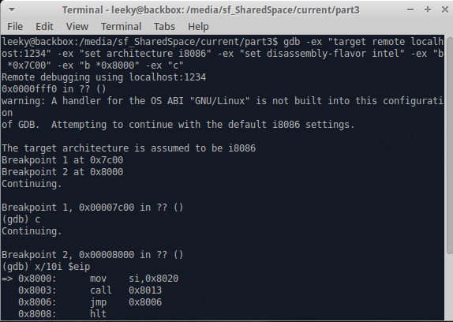

# Realmode Assembly - Writing bootable stuff - Part 3
## Part 3: Building & Running

----------

## What is this?

This is going to be a walk-through in writing an Operation System in assembly which operates purely in Realmode.
Goal will be writing different kernels from a simple "Hello World" over small terminal programs to
graphically displayed games.
	
	
## Requirements:

* Having a compilable bootloader and kernel (last article)
* Accepting my Windows user noobness
* Reading the previous article
	
## Notes

* This information is the result of my research and own programming, everything said here might be wrong, correct me if you spot mistakes though!
* I will try to list my sources at the bottom but I can't guarantee that these are all of them.
* I'M NOT RESPONSIBLE IF YOU BREAK SOMETHING USING INFORMATION I PROVIDED HERE.

## Content of this Article

So this time we will look at ways to build, run and deploy our real mode operation system for qemu and real systems.
After following this you should know some tools (and how to install them) for developing, debuging and deploying your realmode OS.
This isn't really difficult or in depth but I thought I might just post this here for new people / people who never messed with this. If you are fine with the commands from Part 2, already now how to do this or aren't interesting in debugging / deploying you can skip this without fear of missing anything.

----------

## Building everything

Building a resulting binary (one that's bootable) would work either by assembling each file on it's own and put them together after that or by assembling one main file and making them include each other. The second option is obviously less work as only one file needs to be assembled, addresses and offsets are handled by the assembler and you can't accidentally copy things to the wrong place.
Overall we will do both (putting together and including) as the bootloader and kernel both need different starting addresses that are not necessary subsequent which means putting them in one file / making one include the other may result in unwanted problems.

### Installing NASM

```bash
sudo apt-get install nasm
```
### Installing NASM on Windows

```plain
Download from http://www.nasm.us/ (Click Download, search for a recent version, click on win32/win64, download installer)
Optional: Add the installation folder to the PATH variable for quick usage of the 'nasm' command
```

### Assembling with NASM:

```bash
nasm -fbin <file> -o <output>
# -f is the format in this case raw binary, -o is the output file
```
### Putting binaries together

```bash
cat file01.bin file02.bin file03.bin > result.bin
cat bootloader.bin kernel.bin > result.bin
# puts those binaries together to one big binary in exactly this order
```
### Putting binaries together on Windows

```bash
copy /b file01.bin + file02.bin + file03.bin result.bin
copy /b bootloader.bin + kernel.bin result.bin
# /b indicates that this operation is about binaries.
```

### Example for %include in NASM

```asm
..
file1:
%include "file01.asm"
%include "file02.asm"
file3:
%include "file03.asm"
..
* if you now assemble this file you get a big binary as a result
* it contains the code of all included files as the 
* preprocessor just puts the content of those files to the place you included it to
```

## Running in Qemu and Debugging

Running our resulting bootloader and kernel binary in an emulator is pretty easy as well. Most other resources list both Qemu and Bochs, I will skip Bochs though as it's pretty slow compares to Qemu and requires more configuration but I will link an article with a "Hello World" bootloader emulated in Bochs.
Qemu makes it not only possible to quickly test our build OS but also to debug it (Thanks to @hkh4cks and their MiniOS for making me look into that).

### Installing Qemu

```bash
sudo apt-get install qemu-system
```
### Installing Qemu on Windows

```plain
Download from http://www.qemu.org/ (Click Download and look for Windows instructions)
Optional: Add the installation folder to the PATH variable for quick usage of the 'qemu-system-i386' command
Optional: If you want to debug your OS you need gdb. You can get this for Windows though MinGW (http://www.mingw.org/)
```
### Running with Qemu

```bash
qemu-system-i386 result.bin
```

### Debugging with Qemu

```bash
qemu-system-i386 -s -S result.bin
# -s starts a server on port 1234 gdb can connect to, -S makes qemu wait for gdb before executing code
gdb -ex "target remote localhost:1234" -ex "set architecture i8086" -ex "set disassembly-flavor intel" -ex "b *0x7C00" -ex "b *0x8000" -ex "c"
# starts gdb and executes the following commands: connect to qemu's server, tell gdb following code is supposed to be shown in 16bit intel assembly,
# set breakpoint at bootloader start, set breakpoint at kernel start, continue till bootloader starts
```


### Difference to Real System

There a quite a bit of differences considering that qemu only emulates a real system. So it might happen quite often that code works in qemu
but doesn't on a real system (or in reverse), especially when directly accessing memory and not using interrupts.
This happened to me quite often when reading from the drive or working with custom interrupt handlers.
Also qemu just boots the image, it doesn't check if it is in a valid format except if the MBR has the correct signature.


## Running on a real system

Running this your real mode OS is most likely the coolest part! But it's also the part where the most stuff can go wrong.
I've only tried to boot it from USB Flash Drives so far but it should work for SD Cards as well, I can't speak for other devices though.
So before reading further I wanted to post a small list of things that I know of causing this to not work:

* Your BIOS might be configured to boot UEFI only. You can change this in your BIOS configs (press all F<n> keys [F1,F2,..] on boot to open the configuration menu).
* Your BIOS might be configured to fast boot which makes the BIOS skip searching for devices. Just google how to change this as it depends on your main OS.
* Your BIOS might be configured to secure boot only (this is supposed to prevent malicious devices to boot). Change this in the BIOS configs. 
* Device with realmode OS might be low in boot priority. Either change the boot priority within the BIOS configs or choose manually on boot (spamming F10 or F12 after power on/restart to open up the boot menu worked on the systems I tested)
* Your device doesn't contain a correct BIOS Parameter Block which might confuse the BIOS (depends on the device your realmode OS is on)
* Your BIOS doesn't allow booting from a Floppy Disk Drive (I'm sure that there are workarounds for this but I don't know how)
* I hope I don't have to mention that you need a x86 compatible CPU (x86 or x86-64) to run this on your system
* Overall everything here is as low level as it can get so there might be numerous other reasons why stuff doesn't work

Note: I'm very sorry in advance but if nothing posted here helps booting it on your system I won't be able to help you as I barely got it working my computer (after a long time of trial and error).

### Floppy Disk Drive emulation with a USB Flash Drive

If you tried to boot the binary from the last part (I don't really expect that anyone did that) you might have noticed that even though
you selected you device with OS on it, it just skipped over it and booted your normal operation system. Well at least that happened to me.
You might also have noticed that your system doesn't really recognized your device (and recommends to format it - Windows).
I actually don't know why systems (the computers I tested it on at least) aren't able to boot the raw USB Flash Drives (shame on me) 
but I know how we can "disguise" our USB Drive as a Floppy Disk Drive by adding a FAT extended Standard BIOS Parameter Block which makes the content on the drive correctly bootable (The Standard BIOS Parameter Block alone might work but adding a few bytes for the FAT extension won't hurt and tell nomal OS that this is a FAT formated USB Device which removes the "recommend to format" message. DON'T TRY TO COPY DATA ON IT THOUGH AS IT'S NOT A REAL FAT12/FAT16 IMPLEMENTATION).
A BPB (BIOS Parameter Block) contains all data about the layout of the drive and how things are saved on it.
I've already talked about a few of them in Part 2 (LogicalSectors, SectorsPerTrack, Sides) and I won't go into the other values any further if you are interested in more look into the reference section.

I've modified Part 2's bootloader with a modified version MikeOS's BPB and confirmed everything working on my computer:
```asm
org 0x7C00
;Note that the jump and NOP are part of the BPB
jmp short start
nop

; The following code wasn't written by me
; it's just a Standard BIOS Parameter Block with a FAT12/FAT16 extension
; considering the comments are pretty good and already describe the use of each value
; we might just use this as it's working (which is something I had many problems with).
; Source MikeOS
; http://mikeos.sourceforge.net/
; ------------------------------------------------------------------
; Disk description table, to make it a valid floppy
; Note: some of these values are hard-coded in the source!
; Values are those used by IBM for 1.44 MB, 3.5" diskette
OEMLabel		db "Example "	; Disk label
BytesPerSector		dw 512		; Bytes per sector
SectorsPerCluster	db 1		; Sectors per cluster
ReservedForBoot		dw 1		; Reserved sectors for boot record
NumberOfFats		db 2		; Number of copies of the FAT
RootDirEntries		dw 224		; Number of entries in root dir
; (224 * 32 = 7168 = 14 sectors to read)
LogicalSectors		dw 2880		; Number of logical sectors
MediumByte		db 0F0h		; Medium descriptor byte
SectorsPerFat		dw 9		; Sectors per FAT
SectorsPerTrack		dw 18		; Sectors per track (36/cylinder)
Sides			dw 2		; Number of sides/heads
HiddenSectors		dd 0		; Number of hidden sectors
LargeSectors		dd 0		; Number of LBA sectors
; MikeOS's bootloader didn't mention this but the FAT12/FAT16 extension starts here
DriveNo			dw 0		; Drive No: 0
Signature		db 41		; Drive signature: 41 for floppy
VolumeID		dd 00000000h	; Volume ID: any number
VolumeLabel		db "Example    "; Volume Label: any 11 chars
FileSystem		db "FAT12   "	; File system type: don't change!
start: 
; ------------------------------------------------------------------

;Reset disk system
mov ah, 0
int 0x13 ; 0x13 ah=0 dl = drive number

;Read from harddrive and write to RAM
mov bx, 0x8000     ; bx = address to write the kernel to
mov al, 1 		   ; al = amount of sectors to read
mov ch, 0          ; cylinder/track = 0
mov dh, 0          ; head           = 0
mov cl, 2          ; sector         = 2
mov ah, 2          ; ah = 2: read from drive
int 0x13   		   ; => ah = status, al = amount read
jmp 0x8000
times 510-($-$$) db 0
;Begin MBR Signature
db 0x55 ;byte 511 = 0x55
db 0xAA ;byte 512 = 0xAA
```

## Deploying to a USB Device

Ok this will be a bit awkward as I mainly work with Windows which is why I don't have much knowledge how to do this on Linux Systems. ( Please don't hate me :( )
I also don't want to write about untested stuff here so I'll just post a few references here instead.
(Basically you have to write a raw binary to the USB Drive and overwrite the sector 0 of it which isn't possible through simple copying)

### References for doing this on Linux
* http://f.osdev.org/viewtopic.php?f=1&t=28331
* https://stackoverflow.com/questions/1894843/how-can-i-put-a-compiled-boot-sector-onto-a-usb-stick-or-disk
* https://www.cyberciti.biz/faq/howto-copy-mbr/
* https://bipedu.wordpress.com/2013/06/22/live-usb-linux-with-dd-command/
* https://askubuntu.com/questions/22381/how-to-format-a-usb-flash-drive

### Writing to the USB using HHDRawCopy (Windows)

```plain
WARNING: THIS WILL OVERWRITE THE CONTENT OF YOUR USB DRIVE AND YOU WON'T BE ABLE TO USE IT WITHOUT FORMATING IT BEFORE
Download HHDRawCopy from http://hddguru.com/software/HDD-Raw-Copy-Tool/
Start it
Double click the entry with the BUS FILE
Select your resulting binary
Click Continue
Select your USB Drive
Click Continue
Click Start
```

### Looking at the binary in a hexeditor (Windows)

```plain
Download HxD from https://mh-nexus.de/en/hxd/
Either start it normally and look at the resulting binary
Or start it with adminstrator privileges to read directly from your USB Device to check content
```

### Making your USB Usable again (Windows)

I had experience with the Windows formating tool not working so I thought I might just put this here for Windows User:
```plain
1.  Open console
2.  diskpart
3.  list disk
4.  select disk <YOUR DEVICE NUMBER>
5.  clean
6.  create partition primary
7.  format quick fs=fat32
8.  active
9.  assign
10. exit
```

### Booting it

Start/Restart your computer with the drive containing your realmode OS plugged in.
It will now either boot automatically (because of boot priority) or you will need to select it manually by opening the boot selection menu
(spamming F10/F12 on boot for me). If this doesn't work look at the "Running on a real system" section and at the resons why it may have  failed.


## Conclusion

This concludes the building, debugging and deploying part.
If someone is willing to share a photo of their OS booted on a real computer I would be very happy to post it here.
The next part will be about writing a small Console OS which means we will deal with keyboard input and converting values.
If I wrote something wrong just point it out and I will correct it also feedback is appreciated.

### [Next Part](https://github.com/Pusty/realmode-assembly/tree/master/part4)

### [Previous Part](https://github.com/Pusty/realmode-assembly/tree/master/part2)

----------
## Link to source files:
* https://github.com/Pusty/realmode-assembly/tree/master/part3


## Sources and References
* http://blog.ackx.net/asm-hello-world-bootloader.html
* http://wiki.osdev.org/QEMU
* http://mikeos.sourceforge.net/
* https://en.wikipedia.org/wiki/BIOS_parameter_block
* http://wiki.osdev.org/FAT
* http://f.osdev.org/viewtopic.php?f=1&t=28331
* https://stackoverflow.com/questions/1894843/how-can-i-put-a-compiled-boot-sector-onto-a-usb-stick-or-disk
* https://www.cyberciti.biz/faq/howto-copy-mbr/
* https://bipedu.wordpress.com/2013/06/22/live-usb-linux-with-dd-command/
* https://askubuntu.com/questions/22381/how-to-format-a-usb-flash-drive
* http://hddguru.com/software/HDD-Raw-Copy-Tool/
* https://mh-nexus.de/en/hxd/
* https://www.windowscentral.com/how-clean-and-format-storage-drive-using-diskpart-windows-10
* http://www.qemu.org/
* http://www.nasm.us/
* http://www.mingw.org/