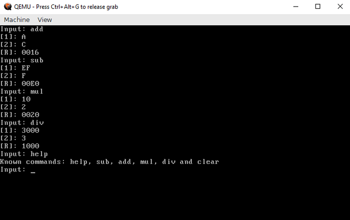

# Realmode Assembly - Writing bootable stuff - Part 4
## Part 4: Basic Math OS

----------

## What is this?

This is going to be a walk-through in writing an Operation System in assembly which operates purely in Realmode.
Goal will be writing different kernels from a simple "Hello World" over small terminal programs to
graphically displayed games.

## Requirements

* Being able to read x86 Intel Assembly
* Being tolerant enough to accept my assembly code even though it might not be perfect
* Reading the previous articles

## Notes

* This information is the result of my research and own programming, everything said here might be wrong, correct me if you spot mistakes though!
* I will try to list my sources at the bottom but I can't guarantee that these are all of them.
* I'M NOT RESPONSIBLE IF YOU BREAK SOMETHING USING INFORMATION I PROVIDED HERE.

## Content of this Article

This article will be about the functions needed to develop a small OS that has a console interface with which the user can do basic math operations.

Putting and explaining the whole example kernel here in this post would be a bit too much so I will only explain core functionality, just look at the Github repository if you are interested in details of it ;)

The main new things introduced this time will be printing out numbers as strings and synchronized keyboard input (meaning the program has to wait for keyboard input and isn't able to execute code while doing so).

----------

## Let's start

So this time we will write a basic math kernel.
It will be able to read in commands/math operations and call functions depending on the command entered and after that it hould ask for 2 numbers to do the math operation with and then print out the result.

Something like:
```plain
add
1
5
=> 6
```
To make our basic math operation system work we will need functions to...

1.  Print out strings to tell the user what to do (already covered in part 2)
2.  Read in user input (real mode code)
3.  Compare input to check which command was entered (general code)
4.  Convert inputed string to numbers to calculate with them (general code)
5.  Calculate with those numbers
6.  Print out the resulting number (real mode code)

## Reading in strings

To read input from our keyboard we use the interrupt 0x16. To specify we will use interrupt 0x16 0 and 0x16,1.
Interrupt 0x16 0 will make the system halt and wait until a key is pressed, it then puts the scancode of the key pressed into AH and the ASCII character (if present for the key pressed) into AL. (See references for scancode table)
Sadly 0x16,0 behaves inconsistent and doesn't always return the wanted result. This can be fixed by checking if a key is pressed at the moment with int 0x16,1 which returns the last pressed scancode into AH and AL (same as 0x16,0) and sets the zero flag depending on if a key on the keyboard is currently pressed:

```plain
|----int----|--ah--|----Zero flag---|----Returned ah----|---Returned al---|--------------Description--------|
|  int 0x16 | 0x0  |    Unchanged   |     Scan code     |    ASCII Code   | Halts until key is pressed      |
|  int 0x16 | 0x1  | No Key pressed |     Scan code     |    ASCII Code   | Read Keyboard status            |
|-----------|------|----------------|-------------------|-----------------|---------------------------------|
```

```asm
;------------------------------------------------------
;=>al = character read(ascii) => ah = character read(keycode) => zf = (1 if nothing read)  | 
readChar:
	mov ah, 1                             ; int 0x16, 0 should be enough but it behaves inconsistent without 0x16, 1 before it
	int 0x16                              ; int 0x16, 1 => check if a key is pressed (set zero flag if not)
	jz .end
	mov ah, 0                             ; int 0x16, 0 => halts till key is pressed and returns it into al and ah
	int 0x16
	ret
	.end:
	mov ax, 0                             ; if no character was pressed return al = 0 and ah = 0
	ret
;------------------------------------------------------
```
To read in strings we will just loop through readChar and save the resulting characters into a temporary buffer. We will have to watch out for some exceptions though, for example backspace(removing a character from the buffer) and enter(returning so far entered string). Also we have to watch out to not forget to null-terminate the string.
The following code has exceptions for backspace and enter but doesn't provide live feedback (doesn't print out the characters entered while typing them), look at the Github repository for a version with it included:
```asm
;------------------------------------------------------
;=>di = string inputed => zf = (1 if nothing read) | changes ax
%define readString_size 8                  ;maximum amount of characters

readString:
	mov di, .buffer                        ;stosb writes into di so let us set di to the start of the buffer
	.inner:
		call readChar                      ;read a character
		jz .inner                          ;if input == 0 repeat reading until enter pressed or max size reached
		cmp ah, 0x1C                       ;zeroflag if enter pressed
		je .end
		cmp ah, 0x0E                       ;zeroflag if backspace pressed
		je .remove
		stosb                              ;store character into buffer and increase di
		cmp di, (.buffer+readString_size)  ;if length of di is >= readString_size => end
		jge .end
	jmp .inner                             ;read next character
	.remove:
		cmp di, .buffer                    ;if di is at index 0 do not remove character as it is already at the beginning
		jle .inner
		dec di                             ;remove a character by moving one index back
		jmp .inner
	.end:
		xor al, al
		stosb                              ;zero terminate string by adding a \0 to it
		mov di, .buffer                    ;set output to buffer beginning
		ret
.buffer resb (readString_size+1)
;------------------------------------------------------
```
## Comparing strings

Comparing strings is essential to be able to process multiple different commands and to differentiate between them.
We do this by first calculating the length of one of the strings and then checking if all characters in the range are equal.
It doesn't matter which of the strings we measure for the length as the zero terminator will be taken as part of the string which means if the zero terminator isn't at the same spot they won't be thought as equal.

```asm
;------------------------------------------------------
;zero flag = set if equals  |
stringCompare:
	pusha                                 ;save all registers
	or cx, -1                             ;set cx to biggest unsigned number
	xor al, al                            ;set al to 0
	repne scasb                           ;scan through di until zero terminator was hit and decrease cx for each scanned character
	neg cx                                ;calculate length of di by negating cx which returns the length of the string including zero terminator
	sub di, cx                            ;reset di by setting it to the original index it started with
	inc di
	repe cmpsb                            ;check if character from di match with si (including zero terminator)
	test cx, cx                           ;test if amount of matching = size of string, set zero flag if equals
	popa                                  ;restore all registers
	ret
;------------------------------------------------------
```


## Converting strings to numbers

So now we can print and read characters and strings but how we write and read numbers?
Well, we have to convert the numbers to ascii-characters and the ascii-characters to numbers.
The method of doing this depends on the number base (2, 8, 10, 16) we work with. The code for this one is written for base 16/hexadecimal numbers but the theory behind it works for base N. 

Converting a hex string into a number works by reading character after character and multiplying the previous result with 16 before adding the value of the last read character. This is based on how numbers representation works with the Nst digit of a number being actually Nst digit * base^N which means this works with base N by replacing the number to multiply with with the base.
```plain
Example:
A    = 10                           = 10
AB   = 10*16+11                     = 171
ABF  = (10*16+11)*16+15             = 2751
ABFF = ((10*16+11)*16+15)*16+15     = 44031

A    = A                            = A
AB   = A*10+B                       = AB
ABF  = (A*10+B)*10+F                = ABF
ABFF = ((A*10+B)*10+F)*10+F         = ABFF
```
```asm
;------------------------------------------------------
;=> dx = hex => zf (zf = FAILED), si = input str |
hexstr2num:
	push ax                                ;save ax and si  
	push si
	xor dx, dx                             ;reset dx and ax to use them for working (dx will contain the resulting number)
	xor ax, ax
	.loop:
		lodsb                              ;load ASCII character from inputed string SI into AL and increase SI
		test al, al                        ;end reading in if reached zero terminator
		jz .end
		shl dx, 4                          ;shifting left by 4 => multiplying with 16
		cmp al, '0'
			jl .error                      ;if character is less than 0x30 it can nott be a number or character
		cmp al, '9'
			jle .num                       ;if character is within the range of 0x30 and 0x39 it is a number
		cmp al, 'A'
			jl .error                      ;if character is bigger than 0x39 and smaller than 0x42 it is not a character
		cmp al, 'F'
			jle .clet                      ;if character is within the range of 0x42 and 0x46 it is a uppercased hex character
		jmp .error                         ;if it is not a number or a hex character => error
		.num:
			sub al, '0'                    ;subtract 0x30 from ASCII number to get value
			jmp .continue
		.clet:
			sub al, 'A'-0xA                ;subtract 0x42 and add 0xA to ASCII uppercased hex character to get value
		.continue:
		add dx, ax                         ;lastResult = (lastResult * 16) + currentNumber;
		jmp .loop	                       ;loop to the next character
	xor ax, ax
	cmp ax, 1                              ;ax != 1 => zero flag not set
	jmp .end
	.error:
		xor dx, dx
		test dx, dx                        ;dx == 0 => zero flag set
	.end:
	pop si                                 ;restore si and ax
	pop ax
	ret
;------------------------------------------------------
```

## Converting numbers to strings

Converting a number to a string (in this case a hex string) works by printing out the digits its made of one by one. The code I used prints out the content of a 8bit register which means 2 hex digits fit in it. The first 4bit and the last 4bit can both be seen as independent numbers and both represent one of the 2 digits the 8bit register will be displayed as.
For a hexadecimal number we need to take in account that digits with a value of 0-9 are to be displayed as a number and digits with a value of 10-15 as letters (A,B,C,D,E,F).
```asm
;------------------------------------------------------
;dl = value to print out  |
printHex:
	call .print           ;call twice to print first 4 bit and last 4 bit
.print:
	ror dl, 4             ;because we want to print last 4 bits first we rotate
	pusha                 ;save registers (as dl has 8bit and gets rotated twice it will end up unchanged as well)
	and dl, 0x0F          ;only read first 4 bits into dl
	mov al, ('0'+0xA)     ;NUM BASE = '0' if dl <  10
	mov bl, 'A'           ;NUM BASE = 'A' if dl >= 10
	sub dl, 0xA           ;subtract 10 from dl to set flags
	cmovae ax, bx         ;if dl >= 0xA: set NUM BASE = 'A'
	add al, dl            ;dl+NUM BASE = ASCII Character
	call printChar        ;prints ASCII character in al
	popa
	ret
;------------------------------------------------------
```

## Screenshot of it working



## Conclusion

We now know how to read characters from the keyboard and how to convert numbers to strings and back.
Next time we will mess with graphic mode and rendering colored things on the screen!
If I wrote something wrong just point it out and I will correct it also feedback is appreciated.


If I wrote something wrong just point it out and I will correct it also feedback is appreciated.

### [Next Part](https://github.com/Pusty/realmode-assembly/tree/master/part5)

### [Previous Part](https://github.com/Pusty/realmode-assembly/tree/master/part3)

----------

## Link to source files:
* https://github.com/Pusty/realmode-assembly/tree/master/part4


## Sources and References
* http://stanislavs.org/helppc/int_16-0.html
* http://stanislavs.org/helppc/int_16-1.html
* http://stanislavs.org/helppc/scan_codes.html
* https://0x00sec.org/t/counting-in-any-number-system/3254
* http://www.asciitable.com/
