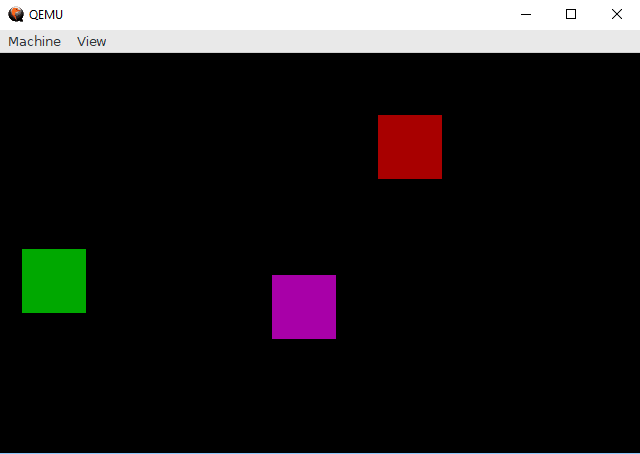
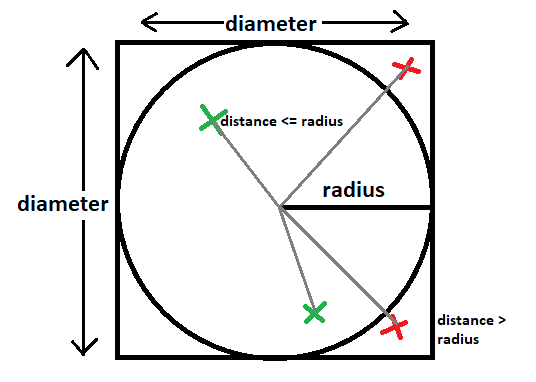
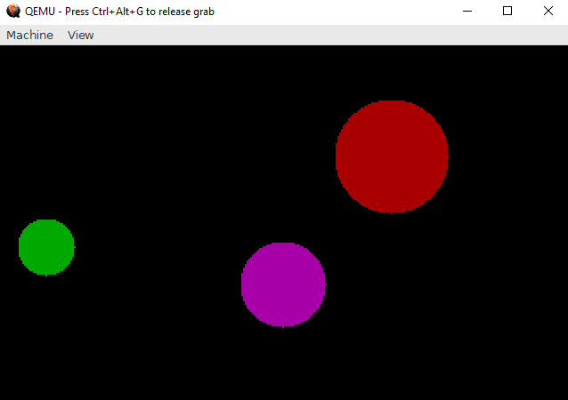
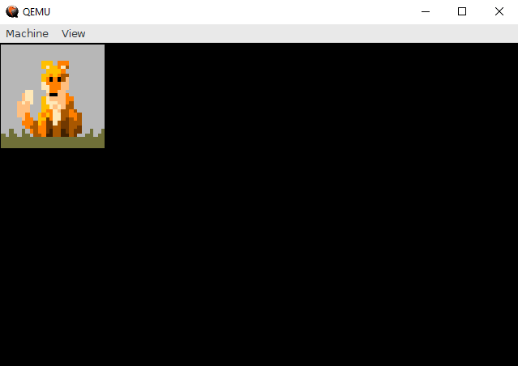
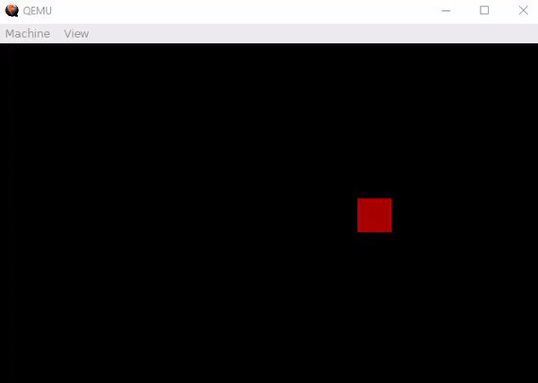

# Realmode Assembly - Writing bootable stuff
## Part 5: Graphic Mode

----------

## What is this?

This is going to be a walk-through in writing  Operation Systems in assembly which operate purely in Realmode.
Goal will be writing different kernels from a simple "Hello World" over small terminal programs to
graphically displayed games.

I decided to split this walk-through into small parts so those few who are interested in this have
enough time to read the necessary theory and references before getting code smashed in the face, 
I hope this prevents the parts from getting unnecessary long or confusing and it also gives
me the time to properly check the information and code I provide (although errors might sneak in
which makes reading the sources for reliable information the recommended way if you are really interested in how this works)

## Requirements

* Understanding x86 assembly
* Reading the previous articles

## Notes

* This information is the result of my research and own programming, everything said here might be wrong, correct me if you spot mistakes though!
* I will try to list my sources at the bottom but I can't guarantee that these are all of them.
* I'M NOT RESPONSIBLE IF YOU BREAK SOMETHING USING INFORMATION I PROVIDED HERE.

## Content of this Article

This article is about rendering pixel, shapes and images in real mode using BIOS interrupts. 

Look into the git repository if you are interested in details not covered in this article :)


----------


## How to render in real mode

You might have asked yourself how the BIOS was able to render text as shown in the previous parts.
Well the answer to that is also the answer of how to render more custom images/shapes (as it uses the same interrupt routines):
After the system BIOS (the one installed on the motherboard) is done with its basic initializing it starts loading the Video BIOS (installed on the graphic card/chip set) which then handles interaction screen interactions through BIOS routines.

By default the Video BIOS starts in a Black/White mode with 40 characters for 25 lines (Mode 00).

As you might remember the interrupt to print characters we used (interrupt 0x10,0xE) had a color attribute not usable for us up to now because of the color restriction.
```plain
|----int----|--ah--|------------al------------|---------bh-------|-------bl-------|-----------Description-----------|
|  int 0x10 | 0xE  | ASCII Character to print | Page to write to | Color Attribute| Print a character to the screen |
|-----------|------|--------------------------|------------------|----------------|---------------------------------|
```
By changing the display mode to Mode 01 we would get access to 16 colors with the same 40 characters for 25 lines configuration and could actually specify colors for text output.

But as you might have guessed we won't use a text mode (like Mode 00 or 01) but a mode with graphic output.
There are a few available and all of them have unique characteristics but from my experience Mode 0x13 is the easiest to use by both interrupts and direct memory access and it provides a good screen size of 320x200 pixel and can display 256 colors at the same time (color palette can be changed through interrupts).
Reason for it being easy to use is that unlike other VGA modes it doesn't use a rather complex reference mode but is accessible as a plain memory with each byte mapped to a pixel on screen.

(More information about the specifications of the BIOS display modes within the "VGABIOS.TXT" and "INTERRUP.TXT")
(More information about how the different graphic modes work at the "OSDevVga" resource)

We can switch graphic modes by using interrupt 0x10, 0x0 and setting al to the display mode we want.
```plain
|----int----|--ah--|-----------------al-------------------|-----------Description-----------|
|  int 0x10 | 0x13 | Number representing new Display Mode | Sets display mode               |
|-----------|------|--------------------------------------|---------------------------------|
```
If we are in a graphic mode (not a text mode) we can use the interrupt 0x10, 0xC to draw pixels.
```plain
|----int----|--ah--|--------------al---------------|---------bh-------|-----cx-----|-----dx-----|----------Description------------|
|  int 0x10 | 0xC  | Index of color within palette | Page to write to | x-position | y-position | Draws a pixel at given point    |
|-----------|------|-------------------------------|------------------|------------|------------|---------------------------------|
```

As I already said we can also write pixels by writing directly to RAM which is significantly faster especially within an emulator but the method to write and the address to write to change for each graphic mode which makes it quite complex to generalize. We will look into that in a later article (but it will be limited to graphic mode 0x13).

Also note that we can still print text within a graphic mode which is really useful for debugging purpose.


OK, so we will use display mode 0x13 so let's switch to it:
```asm
mov ah, 0   ;Set display mode
mov al, 13h ;13h = 320x200, 256 colors
int  0x10   ;Video BIOS Services
```

## Drawing squares

So we know that we can draw single pixels through interrupt 0x10, 0xC but how about more complex shapes?
Let's start simple with a function to draw a square:

Drawing a square consist of iterating through a x-axis and a y-axis and drawing a pixel for each position.

```asm
;------------------------------------------------------
;cx = xpos , dx = ypos, si = x-length, di = y-length, al = color
drawBox:
	push si               ;save x-length
	.for_x:
		push di           ;save y-length
		.for_y:
			pusha
			mov bh, 0     ;page number (0 is default)
			add cx, si    ;cx = x-coordinate
			add dx, di    ;dx = y-coordinate
			mov ah, 0xC   ;write pixel at coordinate
			int 0x10      ;draw pixel!
			popa
		sub di, 1         ;decrease di by one and set flags
		jnz .for_y        ;repeat for y-length times
		pop di            ;restore di to y-length
	sub si, 1             ;decrease si by one and set flags
	jnz .for_x            ;repeat for x-length times
	pop si                ;restore si to x-length  -> starting state restored
	ret
;------------------------------------------------------
```


## Drawing circles

OK, drawing a square was quite simple but how about a circle?

Drawing circles works by iterating through x- and y-axis and then only drawing the pixels with a distance from the middle point lower or equal to the radius.



```plain
	x, y = position of pixel
	middle = middle of circle
	distance = sqrt((x-middle.x)^2 + (y-middle.y)^2)
	if distance <= radius:
		draw pixel
```
Now you might notice the square root function within the pseudo code and although using the FPU(FSQRT) would make that possible a more cheaty approach is way simpler:
```plain
		if distance <= radius:
			draw pixel

  <=> 	if distance^2 <= radius^2:
			draw pixel

  <=>  	distanceNSQRT = (x-middle.x)^2 + (y-middle.y)^2
		if distanceNSQRT <= radius^2:
			draw pixel
```

```asm
;------------------------------------------------------
;cx = xpos , dx = ypos, si = radius, al = color
drawCircle:
	pusha                      ;save all registers
	mov di, si
	add di, si                 ;di = si * 2, di = diameter y-axis
	mov bp, si                 ;bp = copy of radius
	add si, si                 ;si = si * 2, si = diameter x-axis
	.for_x:
		push di                ;save y-length
		.for_y:
			pusha
			add cx, si         ;cx = x-coordinate (start x + si)
			add dx, di         ;dx = y-coordinate (start y + di)
                               ;(x-middle.x)^2 + (y-middle.y)^2 <= radius^2
			                   ;(si-bp)^2 + (di-bp)^2 <= bp^2
			sub si, bp         ;di = y - r
			sub di, bp         ;di = x - r
			imul si, si        ;si = x^2
			imul di, di        ;di = y^2
			add si, di         ;add (x-r)^2 and (y-r)^2
			imul bp, bp        ;signed multiplication, r * r = r^2
			cmp si, bp         ;if r^2 >= distance^2: point is within circle
			jg .skip           ;if greater: point is not within circle
			mov bh, 0          ;page number (0 is default)
			mov ah, 0xC        ;write pixel at coordinate
			int 0x10           ;draw pixel!
			.skip:
			popa
		sub di, 1              ;decrease di by one and set flags
		jnz .for_y             ;repeat for y-length
		pop di                 ;restore di
	sub si, 1                  ;decrease si by one and set flags
	jnz .for_x                 ;repeat for x-length
	popa                       ;restore all registers
	ret
;------------------------------------------------------
```



## Drawing an image

By default the color indexes of interrupt 0x10, 0xC refer to the VGA 256-color palette and although those are changeable through interrupts we can see already see that 256 colors are quite a bit (enough to make the color black appear 10 times in it).


Let's try to encode a small image into those indexes and display it!

```python
#this python script is quite slow for larger images >_<
from PIL import Image                                         #Import Image from Pillow

paletteFile = "colors.png"                                    #palette the BIOS uses
convertFile = "fox.png"                                       #image to turn into a binary
outputFile  = "image.bin"                                     #name of output file

pal = Image.open(paletteFile).convert('RGB')
palette = pal.load()                                          #load pixels of the palette
image = Image.open(convertFile).convert('RGB')
pixels = image.load()                                         #load pixels of the image

binary = open(outputFile, "wb")                                #clear/create binary file

list = []                                                     #create a list for the palette
for y in range(pal.height):
    for x in range(pal.width):
        list.append(palette[x,y])                             #save the palette into an array

binary.write(bytearray([image.width&0xFF,image.height&0xFF])) #write width and height as the first two bytes for variable image size
data = []
for x in range(image.width):
    x = image.width - x - 1                                   #invert x-axis (for shorter assembly code)
    for y in range(image.height):
        y = image.height - y - 1                              #invert y-axis (for shorter assembly code)
        difference = 0xFFFFFFF                                #init difference with a high value
        choice = 0                                            #the index of the color nearest to the original pixel color
        index = 0                                             #current index within the palette array
        for c in list:
            dif = sum([(pixels[x,y][i] - c[i])**2 for i in range(3)]) #calculate difference for RGB values
            if dif < difference:
                difference = dif
                choice = index
            index += 1
        binary.write(bytearray([choice&0xFF]))                #write nearest palette index into binary file as 1 byte
binary.close()                                                #close file handle
print("Done.")
```
```asm
;------------------------------------------------------
;si = image source
drawImage:
	pusha
	xor ax, ax
	lodsb
	mov cx, ax                      ;x-length (first byte of binary)
	lodsb
	mov dx, ax                      ;y-length (2nd byte of binary)
	.for_x:
		push dx
		.for_y:
			mov bh, 0               ;page number (0 is default)
			lodsb                   ;read byte to al (color) -> next byte
			mov ah, 0xC             ;write pixel at coordinate (cx, dx)
			int 0x10                ;draw!
		sub dx, 1                   ;decrease dx by one and set flags
		jnz .for_y                  ;repeat for y-length
		pop dx                      ;restore dx (y-length)
	sub cx, 1                       ;decrease si by one and set flags
	jnz .for_x                      ;repeat for x-length
	popa                            ;restore everything
	ret
;------------------------------------------------------

imageFile: incbin "image.bin"       ;include the raw image binary into the kernel
```



As you might notice the script tries to find the most fitting palette color for a given pixel, this isn't lossless and thus changes the image appearance and quality (obviously considering we just encoded 3 bytes (RGB8) into 1 byte (index within a palette)).
We will look into ways to load our own palettes in a later part to display colors correctly (at least if you don't intent to display more than 256 unique colors at the same time).


## Problems with rendering using interrupts

As of now we've only rendered static images and everything was fine but for something like a game we would want our screen to be more dynamic and render different things each frame.
As we don't want previous frames to overlap with our current one we will need to clear the screen before rending the next frame and that's where stuff goes wrong.

*No code included as it's nothing new really, look into the git repository if you are interested



As you might see in this video the movement of the square is slow and sometimes the screen flickers black.
That is because clearing the screen (drawing a black box that covers the screen) is heavy on the emulator and slows it down remarkable.
You most likely won't notice this on real hardware as the interrupts are processed way faster but this throws up the problem of timing and synchronization. For example long render time could mess up game logic processing or cause the game to run on different tick rates depending on hardware (which isn't good).
And now this annoying flacking (it will also happen on real hardware): The screen refreshes at a specific rate and timing and because our rendering code is not synchronized to that the screen sometimes gets displayed even though the rendering code isn't fully executed yet.

Those and a few other problems (and how to solve them) will be the topic in the next few parts!

## Conclusion

This concludes the rendering through interrupts part.
I hope I was able to show how to use the draw pixel interrupt and how to actually make use of it.
The next and last few parts will consist of using the knowledge from the previous parts (and additional information) to write a small game (I've not yet decided what kind of game to write ,I tend to some jump&run mario thing, but I'm open for suggestions).
If I wrote something wrong just point it out and I will correct it also feedback is appreciated.

### [Next Part](https://github.com/Pusty/realmode-assembly/part6)
### [Previous Part](https://github.com/Pusty/realmode-assembly/part4)

----------

## Link to source files:
* https://github.com/Pusty/realmode-assembly/part5

## Sources and References
* https://en.wikipedia.org/wiki/Video_BIOS
* https://www.pcorner.com/list/TUTOR/HELPPC21.ZIP/INTERRUP.TXT/
* http://minuszerodegrees.net/video/bios_video_modes.htm
* https://en.wikipedia.org/wiki/Mode_13h
* https://en.wikipedia.org/wiki/BIOS_color_attributes
* https://pdos.csail.mit.edu/6.828/2007/readings/hardware/vgadoc/VGABIOS.TXT
* http://www.brokenthorn.com/Resources/OSDevVga.html
* https://upload.wikimedia.org/wikipedia/commons/6/66/VGA_palette_with_black_borders.svg