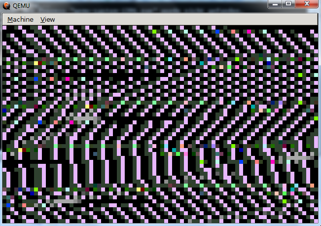
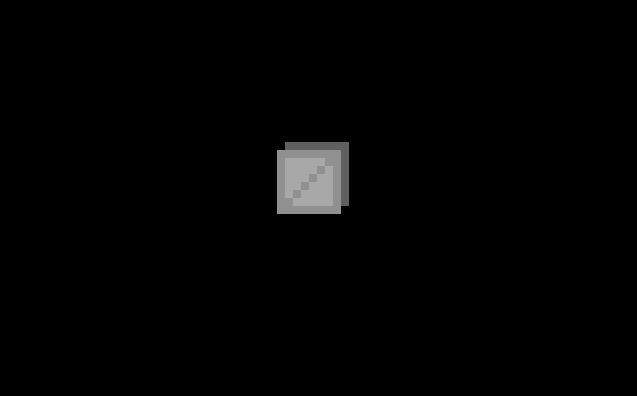
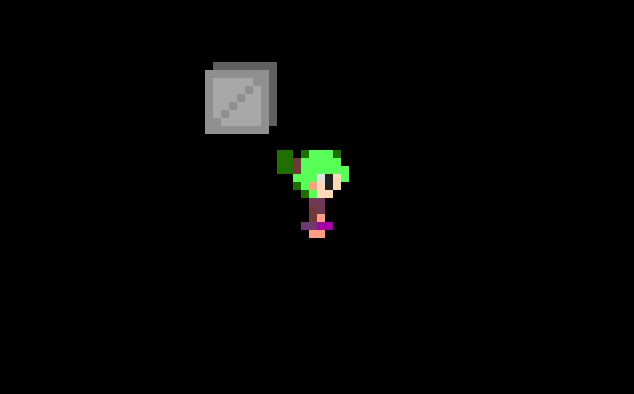
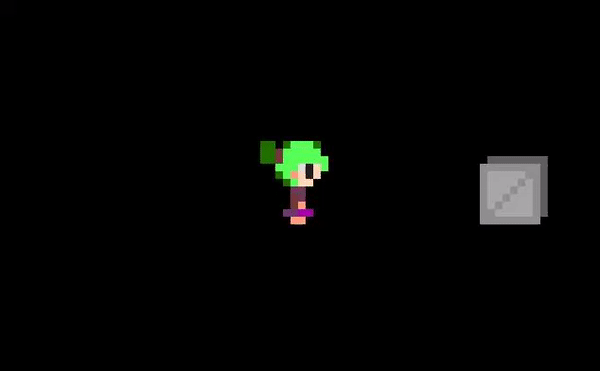

# Realmode Assembly - Writing bootable stuff
## Part 6: Let's write a small game (1/2)

----------

## What is this?

This is going to be a walk-through in writing an Operation System in assembly which operates purely in Realmode.
Goal will be writing different kernels from a simple "Hello World" over small terminal programs to
graphically displayed games.

## Requirements

* Being able to read x86 Intel Assembly
* Being tolerant enough to accept my assembly code even though it might not be perfect
* Reading the previous articles

## Notes

* This information is the result of my research and own programming, everything said here might be wrong, correct me if you spot mistakes though!
* I will try to list my sources at the bottom but I can't guarantee that these are all of them.
* I'M NOT RESPONSIBLE IF YOU BREAK SOMETHING USING INFORMATION I PROVIDED HERE.

## Content of this Article

This article will be about graphical rendering using direct memory addresses (instead of interrupts) which will make rendering faster and more dynamic.
The rest of the article will be skipping over the development of the last example of this series, which will be a little game.
If you are actually interested in the implementation of the game you can take a look into the git project! :D
I've also included a few pictures of bugs in development as that (and full system freezes) are not something one sees often in higher level development (well at least I hope so).

----------

## Let's start

So let's start with listing what be essentially need for our game: We need graphical rendering and a controllable character.

## Graphical Rendering

As already said the graphical rendering in this part will be done with direct memory access instead of using interrupts.
For graphic mode 0x13 this is actually pretty straightforward as we can write the color (or better said the index within the palette for a color) to the address of the pixel where all pixels displayed are directly after each other.
To do this we have to write to the Video memory which is positioned at 0xA0000.
For example the pixel(0,0) is at 0xA0000 the pixel(1,0) is at 0xA0001 and the pixel(0,1) is at 0xA0140 (as you might remember that mode 0x13 is 320*200 in size).
In some memory modes writing onto the screen is as easy as this while in others (especially bigger VGA modes) memory is divided into several planes which makes it more complex.

In actual usage it's not possible to specify the address to 0xA0000,0xA0001,etc though because an address has to be 16bit in Realmode.

We avoid this restriction by looking into how physical addresses are calculated:
```
Logical address = A:B
Physical address = (A * 0x10) + B
A = 64k segment
B = Offset within segment
```
The segment A is specified by the segment register B (CS,DS,SS,ES,FS,GS) used by the instruction that accesses memory . If we don't specify segment registers the default values for a given instruction are used, so we use segment registers for every memory interaction.

If we now for example look at the description of the STOSB instruction("Store AL at address ES:(E)DI") we can see this instruction uses the ES segment register to specify the output segment.

If we now write something like:
```asm
mov es, 0xA000 ; 0xA0000 / 0x10
mov di, 0x140
mov al, 0x9
stosb
```
We write the number 9 to the physical address 0xA0140 (0xA000 * 0x10 + 0x140 = 0xA0140 => pixel(0,1)) in a pretty efficient manner.


Maybe you also remember the flicking (or better said, moments on which screen display and screen write overlapped) we had in the last part, let's also fix that by double buffering the screen.
We do that by directing all our draw functions to a buffer memory region and after all drawing has been done (end of a game tick) we write the full buffer to the Video memory at once.
As the screen isn't edited while game logic and rendering takes place (which might take some time) but after everything is done in a quick write we don't have synchronization problems anymore.
But now we encounter a new problem, where do we get a 320*200 = 64000 byte buffer (or better said a whole segment) from? My solution isn't really ideal, I just upscaled all pixels by 4 which reduced the needed buffer size to 80*50=4000 which I found just somewhere within the usable RAM.
0x7E00-0x7FFFF provides 480.5 KiB so I could have just put it into there but I liked the look of x4 pixels and it also keeps resource size small so I went with that. (not to mention that it saves me the trouble of animating a 36*48 sprite just to fill the screen the same amount)

Last thing to note before showing the actual code is that we have relative positioned sprites in the game (relative to the player) so we have to make sure that no drawing function tries to write outside our designated buffer area (which of course if limited in size) which is something that might happen if positions get negative, go outside of screen or go only partly outside of the screen.
If we don't watch out for that stuff like that his happens:



```asm
;screen has size 320x200 but buffer only 80x50
copyBufferOver:
	pusha                        ;save all general purpose registers
	push es                      ;save segment register es
    mov es, word [graphicMemory] ;set es to the segment 0xA0000
    xor di, di
	mov cx, 200                  ;for y-length of video memory
	.loop:
		mov dx, cx               ;save current y position in dx
		mov cx, 320/4            ;for x-length of video memory
		.innerloop:
			mov si, 320
			sub si, cx           ;set x-offset for buffer with inverted x-axis
			mov bx, 200
			sub bx, dx           ;invert y-axis
			shr bx, 2            ;divide y position within screen by 4 to get index within buffer
			imul bx, 80          ;multiply with buffer width to get an index
			add si, bx           ;add y-offset for buffer
			add si, [screenPos]  ;make the offset a logical address
			lodsb                ;read from buffer (ds:si)
			mov ah, al           ;duplicate pixel
			stosw                ;write 2*2 pixel row to graphic memory (es:di)
			stosw
		loop .innerloop
		mov cx, dx               ;restore saved y position
	loop .loop
	pop es                      ;restore segment register es
	popa                        ;restore all general purpose registers
	ret
	
;si = position of image, ax = xpos, bx = ypos
;a bit messy because of all the error checks to not draw out of screen
drawImage:
	pusha
	xor di, di
	imul di, bx, 80                    ;set di to the y-offset*width to address an index
	add di, [screenPos]                ;add address of the buffer to make it an address within it
	add di, ax                         ;add offset of x-position
	mov bp, ax                         ;bp = x-position
	xor ax, ax                         ;reset ax (especially higher byte as it doesn't get written to by loadsb)
	lodsb                              ;read x-size of binary
	mov cx, ax                         ;save x-size into cx
	lodsb                              ;read y-size of binary
	mov dx, ax                         ;save y-size into dx
	.for_y: 
			mov bx, di                 ;bx is set to the offsetOnScreen and a few checks are made to ensure the line is on screen
			add bx, cx                 ;bx = offsetOnScreen + xsize
			sub bx, word [screenPos]   ;skip if line (or better said last pixel of the line) is out of screen (above screen)
			jl .skip_x
			sub bx, cx                 ;reset bx to the offsetOnScreen as the line appears to be on screen
			sub bx, 80*50              ;skip if line (or better said first pixel of the line) is out of screen (bellow screen)
			jge .skip_x               
			xor bx, bx                 ;everything is fine with this line!
		.for_x:
			mov al, byte [si+bx]       ;read pixel within the image
			test al, al                ;skip if pixel value is 0 and treat it as transparent
			jz .skip
			cmp bx, 80                 ;if pixel is right out of screen, skip it
			jge .skip
			cmp bx, 0                  ;if pixel is left out of screen, skip it
			jl .skip
			mov byte [di+bx], al       ;write pixel value from image to buffer
			.skip:
			inc bx                     ;increase index within image and buffer
			cmp bx, cx                 ;repeat until the line ends
		jl .for_x
		.skip_x:
		add di, 80                     ;next row within buffer
		add si, cx                     ;next row within image
		dec dx                         ;decrease index of line
	jnz .for_y                         ;repeat for y-length
	popa
	ret
    
    graphicMemory dw 0xA000            ;segment register value for Video memory
    screenPos dw 0x0500                ;buffer will be at this address
```

With a modified image2binary.py script we can now finally display images:



## Adding a Character

With our modified rendering code adding a player (kernel.asm@line 19) and making the objects relative to it (kernel.asm@drawEntity) isn't really a problem, we just have to subtract the player position from the other objects and then add the position of the center of the screen (because that's where the player is actually displayed).



We already talked about key input in Part 4, I used the same readChar code for this project for now:
``` asm
checkKey:
	mov ah, 1
	int 0x16    ;interrupt 0x16 ah=1 => read key status, zeroflag if no key pressed
	jz .end
	mov ax, 0
	int 0x16    ;interrupt 0x16 ah=0 => read key pressed, fills al and ah
	ret
	.end:
	mov ax, 0   ;return 0 if no key is pressed
	ret
```
The key pressed decided what direction to move to, no key or a key not included in the controls results in stopping. (kernel.asm@gameControls)
This way sadly has the problem of having a delay after releasing a key (or pressing a new key) which results in a delayed movement, we will fix that in the next part.

I also added collision but that's just code that checks if the hitboxes of two entities overlap so nothing special (kernel.asm@checkForCollision).




## Conclusion

We now have seen how to draw directly onto the screen in graphic mode 13h and how to address different segments.
The next and last part will finish this project and be about handling hardware interrupts (focused on key events).
If I wrote something wrong just point it out and I will correct it also feedback is appreciated.


### [Next Part](https://github.com/Pusty/realmode-assembly/part7)

### [Previous Part](https://github.com/Pusty/realmode-assembly/part5)

----------

## Link to source files:
* https://github.com/Pusty/realmode-assembly/part6


## Sources and References
* http://wiki.osdev.org/Drawing_In_Protected_Mode
* http://wiki.osdev.org/Memory_Map_(x86)
* http://bos.asmhackers.net/docs/vga_without_bios/
* http://wiki.osdev.org/Segmentation
* http://faydoc.tripod.com/cpu/stosb.htm
* https://en.wikipedia.org/wiki/Multiple_buffering#Double_buffering_in_computer_graphics
